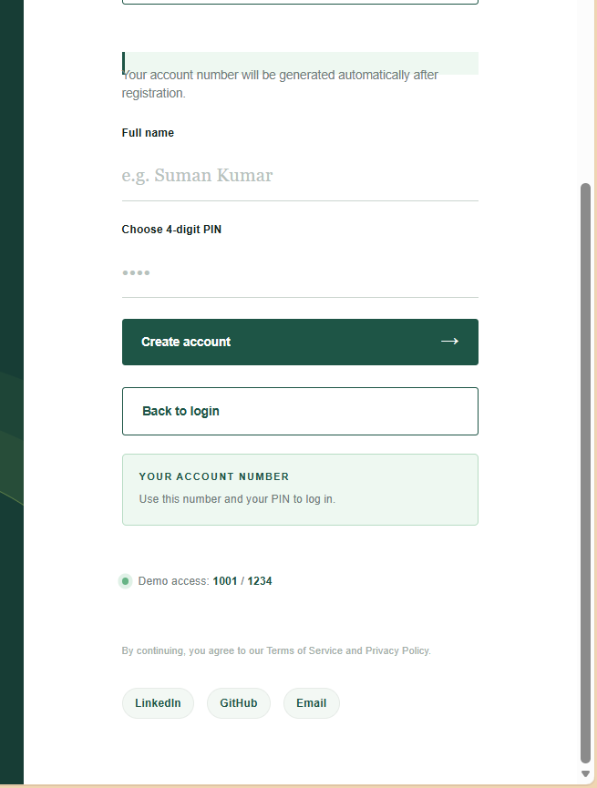
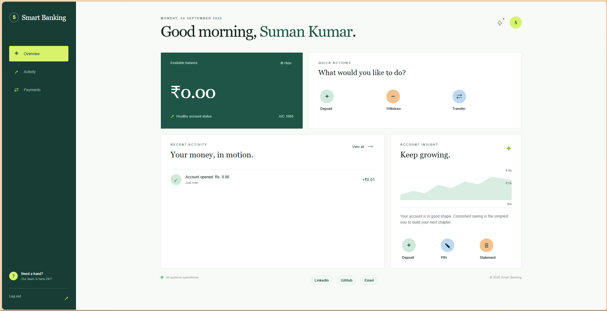
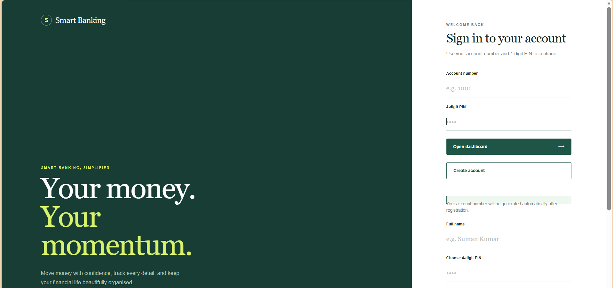

# 🏦 Smart Banking

A modern **Smart Banking Management System** built with a responsive web interface and a lightweight **C-based banking backend**.

The project demonstrates core banking operations such as account creation, secure login flow, balance management, deposits, withdrawals, money transfers, transaction history, and PIN management through a browser-based dashboard.

> **Note:** This project is an educational/demo banking application and is **not intended for real financial transactions or production banking use**.

---

## ✨ Features

### 🔐 Authentication

* Account number + 4-digit PIN login
* New account registration
* Automatically generated account numbers
* Client-side form validation
* Session-based account tracking using `sessionStorage`
* Logout functionality

The frontend communicates with the backend through HTTP API requests for login and account creation.

### 💰 Banking Operations

* Check account balance
* Deposit money
* Withdraw money
* Transfer money between accounts
* View mini statement
* Change account PIN
* Automatic balance updates after transactions

The C backend maintains account balances and records transaction messages for deposits, withdrawals, and transfers.

### 📊 Dashboard

The dashboard provides:

* Current balance
* Account number
* User profile/avatar
* Quick banking actions
* Recent transactions
* Statement modal
* Hide/show balance option
* Logout

The frontend loads the authenticated account from the backend and renders the account information dynamically.

### 🎨 Modern UI

* Responsive banking interface
* Clean financial dashboard
* Dark green banking theme
* Lime accent colors
* Responsive login screen
* Modal-based banking operations
* Mobile-friendly layout
* Hover and focus interactions

## The interface uses a custom CSS design system with responsive dashboard, sidebar, balance card, quick actions, transaction panels, and modal components.

## 🛠️ Tech Stack

| Technology         | Purpose                              |
| ------------------ | ------------------------------------ |
| **HTML5**          | Web page structure                   |
| **CSS3**           | Responsive UI and styling            |
| **JavaScript**     | Frontend logic and API communication |
| **C**              | Banking backend/server               |
| **HTTP**           | Client-server communication          |
| **JSON**           | API request/response format          |
| **File Storage**   | Local banking data persistence       |
| **SessionStorage** | Browser-side session tracking        |

---

## 🏗️ Project Architecture

```text
Smart Banking
│
├── Frontend
│   ├── HTML
│   ├── CSS
│   └── JavaScript
│
├── Backend
│   └── C HTTP Server
│
└── Data
    └── bank_data.dat
```

### Frontend

The JavaScript frontend uses a centralized API request function to communicate with the backend running on:

```text
http://localhost:8080
```

### Backend

The C backend stores accounts in memory and persists the banking data to:

```text
bank_data.dat
```

It supports up to **50 accounts** and stores up to **20 transaction records per account**.

---


## 📸 Screenshots

### 🔐 Login Page


### 📊 Dashboard


### 💳 Banking Operations


### 📜 Transaction History


### 🆕 Create Account


## 🔌 API Endpoints

The backend exposes HTTP endpoints for frontend communication.

### Health Check

```http
GET /api/health
```

Checks whether the banking API is running.

### Get Account

```http
GET /api/account?accountNumber=1001
```

Returns account information and transaction history.

### Create Account

```http
POST /api/create-account
```

Example request:

```json
{
  "name": "Suman Kumar",
  "pin": 1234
}
```

### Login

```http
POST /api/login
```

Example:

```json
{
  "accountNumber": 1001,
  "pin": 1234
}
```

### Banking Operations

```text
POST /api/deposit
POST /api/withdraw
POST /api/transfer
POST /api/change-pin
```

The frontend sends the selected account number and operation-specific values to these endpoints.

---

## 👤 Demo Account

For demonstration purposes, the backend initializes sample accounts when no existing banking data is available.

| Account | Name  |  PIN | Opening Balance |
| ------- | ----- | ---: | --------------: |
| 1001    | Rahul | 1234 |          ₹5,000 |
| 1002    | Amit  | 5678 |          ₹8,000 |
| 1003    | Neha  | 9876 |         ₹10,000 |

These demo accounts are defined in the C backend.

> **Demo credentials are included only for local testing. Do not use real PINs or financial information.**

---

## 🚀 How to Run

### 1. Clone the Repository

```bash
git clone YOUR_GITHUB_REPOSITORY_URL
cd smart-banking
```

### 2. Compile the C Backend

Using GCC:

```bash
gcc server.c -o server
```

On Windows, if required:

```bash
gcc server.c -o server.exe -lws2_32
```

The backend includes platform-specific socket handling for Windows and Unix-like systems.

### 3. Start the Backend

```bash
./server
```

On Windows:

```bash
server.exe
```

The server runs on:

```text
http://localhost:8080
```

### 4. Open the Frontend

Open the login page in your browser:

```text
login page.html
```

Make sure the C backend is running before attempting to log in or perform banking operations.

---

## 🔄 Application Flow

```text
                 ┌──────────────────┐
                 │   Login Page      │
                 └────────┬─────────┘
                          │
              Account + 4-Digit PIN
                          │
                          ▼
                 ┌──────────────────┐
                 │   C Backend      │
                 │   /api/login     │
                 └────────┬─────────┘
                          │
                     Authentication
                          │
                          ▼
                 ┌──────────────────┐
                 │    Dashboard     │
                 └────────┬─────────┘
                          │
          ┌───────────────┼────────────────┐
          ▼               ▼                ▼
       Deposit         Withdraw         Transfer
          │               │                │
          └───────────────┼────────────────┘
                          ▼
                 ┌──────────────────┐
                 │ Updated Account  │
                 │ + Transactions   │
                 └──────────────────┘
```

---

## 💾 Data Persistence

Banking data is stored locally using a binary file:

```text
bank_data.dat
```

The backend saves the account count and account records whenever banking data changes.

This allows account information and transaction data to persist between server sessions.

---

## 🔒 Security Considerations

This project demonstrates banking concepts for **learning and portfolio purposes**.

It should **not** be deployed as a real banking system without significant security improvements.

Areas that would need improvement for production use include:

* Password/PIN hashing instead of storing PINs directly
* HTTPS/TLS
* Proper authentication tokens/sessions
* Server-side authorization
* Rate limiting and account lockout persistence
* Secure database instead of local binary storage
* Input validation and robust JSON parsing
* CSRF protection where applicable
* Secure CORS configuration
* Audit logging
* Transaction IDs and timestamps
* Concurrency/thread-safety
* Proper error handling
* Database transactions/atomic operations

The current backend does implement basic input validation and limits login attempts in its console login flow.

---

## 📱 Responsive Design

The interface is designed to adapt across different screen sizes.

## The login page uses a responsive two-column layout, while the dashboard uses a sidebar-based banking interface with responsive grid layouts.

## 🎯 Learning Objectives

This project helped demonstrate practical concepts including:

* C programming
* Structures and arrays
* File handling
* Socket programming
* HTTP request handling
* REST-style API design
* JSON formatting
* HTML/CSS UI development
* JavaScript DOM manipulation
* Fetch API
* Session management
* CRUD-style banking operations
* Input validation
* Client-server architecture

---

## 🔮 Future Improvements

Possible future upgrades include:

* [ ] SQLite/MySQL/PostgreSQL database
* [ ] Password/PIN hashing
* [ ] JWT/session-based authentication
* [ ] HTTPS support
* [ ] Transaction timestamps
* [ ] Unique transaction IDs
* [ ] Downloadable bank statements
* [ ] Search and filter transactions
* [ ] Monthly spending analytics
* [ ] Charts and financial insights
* [ ] Profile management
* [ ] Admin dashboard
* [ ] Email/SMS notifications
* [ ] Multi-factor authentication
* [ ] Improved API security
* [ ] Production-ready deployment

---

## 📸 Project Highlights

### Login

Modern banking login interface with account authentication and account creation.

### Dashboard

Personal banking dashboard with balance information, account details, quick actions, and transactions.

### Transactions

Users can perform:

```text
Deposit
   ↓
Withdraw
   ↓
Transfer
   ↓
Mini Statement
```

### Account Management

Users can create accounts and change their 4-digit PIN through the application.

---

## 👨‍💻 Developer

**Suman Kumar**

B.Tech CSE — AI & Data Science
Full Stack Development | AI/ML | Data Science

### Connect

* LinkedIn: [Suman Kumar](https://www.linkedin.com/in/suman-kumar-93b1b4314/)
* GitHub: [suman9834](https://github.com/suman9834)
* Email: [sumankumargin01234@gmail.com](mailto:sumankumargin01234@gmail.com)

---

## 📄 License

This project is intended for educational and portfolio purposes.

If a specific open-source license is added to the repository, update this section accordingly.

---

## ⭐ Support

If you find this project useful for learning or portfolio inspiration, consider giving the repository a ⭐.

**Built with HTML, CSS, JavaScript and C — Smart Banking, simplified.**
